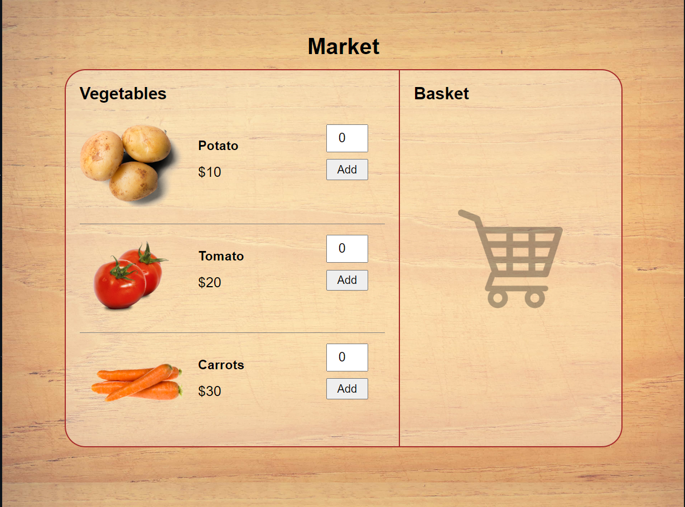

# Market Web App
This is a simple web app that simulates a market where customers can add vegetables to their basket and view the total cost of their purchases. The app consists of a single HTML file (`index.html`), a CSS file (`style.css`), and a JavaScript file (`script.js`).

## Usage
To use the app, simply open the `index.html` file in your web browser. The app displays a list of vegetables that can be added to the customer's basket. For each vegetable, the customer can specify the quantity they wish to purchase, and click the "Add" button to add the item to their basket.

The app keeps track of the total cost of the customer's purchases and displays it in the basket section of the app. Customers can also remove items from their basket by clicking the "Remove" button next to the item.

## Functionality
The JavaScript file (`script.js`) contains two functions that implement the core functionality of the app:

**`addToCart(element)`**
This function is called when the customer clicks the "Add" button for a given vegetable. It extracts the name, price, and quantity of the vegetable from the corresponding HTML elements, calculates the total cost of the item, adds the item to the customer's basket, updates the total cost of the customer's purchases, and disables the "Add" button for the item.

**`removeFromCart(element)`**
This function is called when the customer clicks the "Remove" button for a given item in their basket. It extracts the name and price of the item from the corresponding HTML elements, removes the item from the customer's basket, updates the total cost of the customer's purchases, and enables the "Add" button for the corresponding vegetable.

## App look like this:

